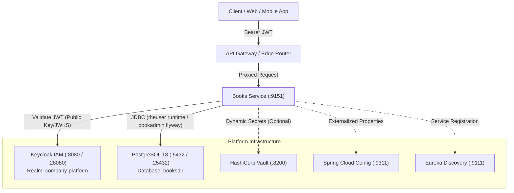
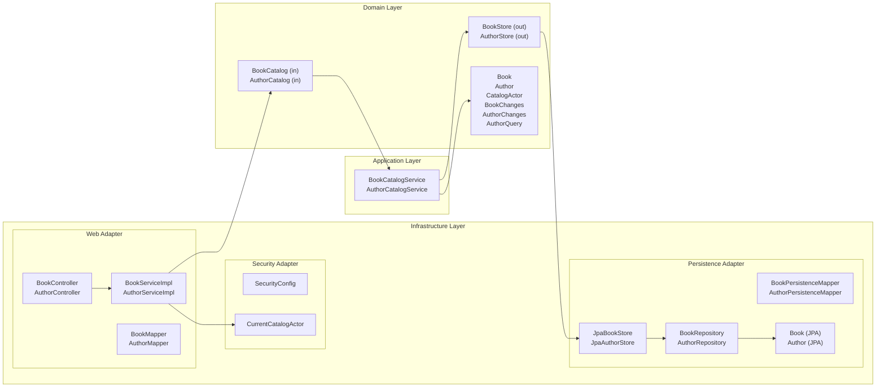
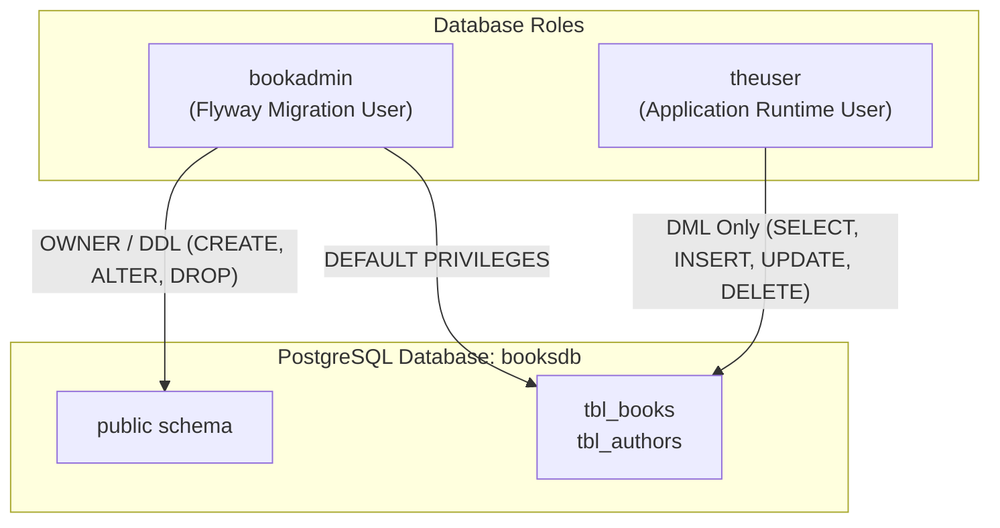

# Books Service

[](https://adoptium.net/)
[](https://spring.io/projects/spring-boot)
[](https://spring.io/projects/spring-cloud)
[](https://www.postgresql.org/)
[](https://flywaydb.org/)
[](https://www.keycloak.org/)

**Books Service** is a core domain microservice responsible for maintaining the platform's central catalog of books and authors, including book ownership, author metadata, and catalog query capabilities.

> [!NOTE]
> **Service Boundaries**: Books Service is exclusively a metadata and catalog service. It does **not** store binary book assets (PDFs, EPUBs, audiobooks) nor manage content publishing/ingestion pipelines. Book files, DRM, and binary streaming are owned by downstream content storage services.

---

## Table of Contents

- [System Context & Ecosystem](#system-context--ecosystem)
- [Architecture & Design Principles](#architecture--design-principles)
  - [Clean / Hexagonal Architecture](#clean--hexagonal-architecture)
  - [Package Layout](#package-layout)
  - [Domain Invariants & Business Logic](#domain-invariants--business-logic)
- [Security & Access Control](#security--access-control)
  - [Authentication & JWT Token Structure](#authentication--jwt-token-structure)
  - [Catalog Actor Resolution](#catalog-actor-resolution)
  - [Access Control Matrix](#access-control-matrix)
- [REST API Specification](#rest-api-specification)
  - [Public Endpoints](#public-endpoints)
  - [Book Endpoints](#book-endpoints)
  - [Author Endpoints](#author-endpoints)
  - [Pagination & Sorting Parameters](#pagination--sorting-parameters)
- [Request & Response Payloads](#request--response-payloads)
- [cURL Examples](#curl-examples)
- [Error Handling & Problem Details](#error-handling--problem-details)
- [Database Architecture & Migrations](#database-architecture--migrations)
  - [PostgreSQL Schema](#postgresql-schema)
  - [Dual-User Least Privilege Model](#dual-user-least-privilege-model)
  - [Flyway Migrations](#flyway-migrations)
  - [Sample Seed Data](#sample-seed-data)
- [Configuration & Profiles](#configuration--profiles)
  - [Spring Profiles](#spring-profiles)
  - [Environment Variables Reference](#environment-variables-reference)
- [Build, Toolchain & Testing](#build-toolchain--testing)
  - [Java 27 & Gradle Launch Setup](#java-27--gradle-launch-setup)
  - [Running Unit & MVC Tests](#running-unit--mvc-tests)
  - [Running Integration Tests (Testcontainers)](#running-integration-tests-testcontainers)
  - [Building Application Artifacts](#building-application-artifacts)
- [Running Locally](#running-locally)
  - [Option A: Standalone JVM with Local DB & Keycloak](#option-a-standalone-jvm-with-local-db--keycloak)
  - [Option B: Complete Stack via Docker Compose](#option-b-complete-stack-via-docker-compose)
- [Docker & Container Deployment](#docker--container-deployment)
- [Observability & Actuator](#observability--actuator)
- [Roadmap & Sibling Dependencies](#roadmap--sibling-dependencies)

---

## System Context & Ecosystem

Books Service operates within a distributed microservices platform:



- **Keycloak IAM**: Issues signed JWT access tokens containing user identity (`sub`) and realm roles (`roles`). Books Service operates as an OAuth2 Resource Server validating JWTs.
- **PostgreSQL (`booksdb`)**: Persistent relational store with dedicated accounts for DDL migrations (`bookadmin`) and DML runtime (`theuser`).
- **HashiCorp Vault**: External secret management providing database credentials and signing keys via Spring Cloud Vault.
- **Spring Cloud Config Server**: Centralized configuration management across `dev`, `qa`, and `prod` stages.
- **Eureka Discovery**: Service registry enabling dynamic service discovery across the platform.

---

## Architecture & Design Principles

### Clean / Hexagonal Architecture

Books Service strictly adheres to **Clean Architecture** (Hexagonal / Ports & Adapters) principles:



1. **Domain Layer (`books.domain`)**:
   - Zero framework dependencies (no Spring, no Hibernate, no Jackson).
   - Immutable records model core concepts: `Book`, `Author`, `CatalogActor`, `BookChanges`, `AuthorChanges`, `AuthorQuery`.
   - Encapsulates business invariants, validation, access checks, and state transitions.
   - Defines inbound use case ports (`BookCatalog`, `AuthorCatalog`) and outbound storage ports (`BookStore`, `AuthorStore`).
2. **Application Layer (`books.application.usecase`)**:
   - Implements inbound ports (`BookCatalogService`, `AuthorCatalogService`).
   - Orchestrates domain interactions and manages `@Transactional(readOnly = true)` boundaries.
   - Independent of transport formats (HTTP, JSON) and relational databases.
3. **Infrastructure Layer (`books.infrastructure`)**:
   - **Web**: Spring MVC REST controllers (`BookController`, `AuthorController`), DTO contracts, validation constraints, MapStruct DTO mappers, and `GlobalExceptionHandler`.
   - **Security**: Stateless OAuth2 Resource Server configuration, JWT conversion (`KeycloakRealmRoleConverter`), and security context resolution (`CurrentCatalogActor`).
   - **Persistence**: Spring Data JPA repositories, JPA entities (`tbl_books`, `tbl_authors`), MapStruct entity mappers, and repository implementations (`JpaBookStore`, `JpaAuthorStore`).

### Package Layout

```
src/main/java/books/
├── BooksApplication.java                      # Spring Boot main entrypoint
├── domain/                                    # Framework-free Core Domain
│   ├── model/
│   │   ├── Book.java                          # Immutable Book domain aggregate
│   │   ├── Author.java                        # Immutable Author domain aggregate
│   │   ├── CatalogActor.java                  # Requesting actor identity & roles
│   │   ├── BookChanges.java                   # Value object for book mutations
│   │   ├── AuthorChanges.java                 # Value object for author mutations
│   │   ├── AuthorQuery.java                   # Search & pagination specification
│   │   └── *Exception.java                    # Domain exceptions (BookNotFound, etc.)
│   └── port/
│       ├── in/                                # Driving / Use Case Ports
│       │   ├── BookCatalog.java
│       │   └── AuthorCatalog.java
│       └── out/                               # Driven / Persistence Ports
│           ├── BookStore.java
│           └── AuthorStore.java
├── application/
│   └── usecase/                               # Use case services & orchestration
│       ├── BookCatalogService.java
│       └── AuthorCatalogService.java
└── infrastructure/                            # Adapters & framework wiring
    ├── config/                                # Spring configurations (Logging, Flyway)
    ├── security/                              # JWT & CatalogActor adapter
    ├── web/                                   # REST Controllers, DTOs, Mappers, Exceptions
    └── persistence/                           # JPA Entities, Repositories, Flyway, Stores
```

### Domain Invariants & Business Logic

- **Book Validation**:
  - `title`: Required, 1 to 100 characters, whitespace automatically stripped. Must be unique in the database.
  - `description`: Optional, maximum 100 characters.
  - `completed`: Normalized to `false` when `null`.
- **Author Validation**:
  - `firstName`: Required, 1 to 255 characters, whitespace automatically stripped.
  - `lastName`: Optional, maximum 255 characters.
  - `genre`: Optional, maximum 255 characters.
- **Ownership & Anti-Spoofing Rules**:
  - Ordinary users **cannot** spoof book ownership (`userId`). Even if a request payload supplies an arbitrary `userId`, domain rules enforce that newly created books are bound to the caller's JWT `sub`.
  - Non-manager users **cannot transfer book ownership**. Any patch attempt to modify `userId` throws a `CatalogAccessDeniedException`.
  - Catalog managers (`ROLE_ADMIN`, `ROLE_MANAGER`) are permitted to assign or reassign book ownership to any valid UUID.
- **Author Modification Guard**:
  - Creating, updating, or deleting authors requires catalog manager privileges (`ROLE_ADMIN` or `ROLE_MANAGER`). Ordinary users receive `403 Forbidden`.

---

## Security & Access Control

### Authentication & JWT Token Structure

The service operates as a stateless OAuth2 Resource Server. Every request (outside explicit public endpoints) requires a valid Bearer token in the `Authorization` header:

```http
Authorization: Bearer <Keycloak-JWT-Token>
```

The JWT is validated against Keycloak's public JWKS endpoint (`KEYCLOAK_ISSUER_URI`). The token must contain:
- `sub`: User ID formatted as a valid UUID (e.g. `c0a80101-0000-0000-0000-000000000001`).
- `realm_access.roles`: Array of realm-level roles (e.g., `["USER", "MANAGER", "ADMIN"]`).
- `scope`: Space-delimited OAuth2 scopes (e.g. `openid catalog.read`).

`KeycloakRealmRoleConverter` converts these claims into Spring Security authorities:
- Realm roles become `ROLE_<role>` (e.g., `ROLE_ADMIN`, `ROLE_MANAGER`, `ROLE_USER`).
- Scopes become `SCOPE_<scope>` (e.g., `SCOPE_openid`, `SCOPE_catalog.read`).

### Catalog Actor Resolution

`CurrentCatalogActor` resolves the current security context into a `CatalogActor`:
- Extracts the caller's UUID from `jwt.getToken().getSubject()`.
- Sets `managesCatalog = true` if the caller holds `ROLE_ADMIN` or `ROLE_MANAGER`.
- Rejects requests with `403 Forbidden` if the subject is missing or not a valid UUID.

### Access Control Matrix

| Operation | HTTP / Endpoint | Public | User (`ROLE_USER`) | Manager / Admin (`ROLE_ADMIN`, `ROLE_MANAGER`) |
|---|---|:---:|:---:|:---:|
| **Ping Service** | `GET /api/books/ping` | :white_check_mark: | :white_check_mark: | :white_check_mark: |
| **Health / Info** | `GET /actuator/health`, `info` | :white_check_mark: | :white_check_mark: | :white_check_mark: |
| **OpenAPI / Swagger** | `GET /api-docs/**`, `/swagger-ui/**` | :white_check_mark: | :white_check_mark: | :white_check_mark: |
| **List / Search Books** | `GET /api/books/**` | :x: (401) | :white_check_mark: | :white_check_mark: |
| **Create Book** | `POST /api/books` | :x: (401) | :white_check_mark: (Owner bound to caller) | :white_check_mark: (Can set any `userId`) |
| **Update Book** | `PUT /api/books` | :x: (401) | :white_check_mark: (Owned books only; no owner transfer) | :white_check_mark: (Any book; can transfer owner) |
| **Delete Book** | `DELETE /api/books/{id}` | :x: (401) | :white_check_mark: (Owned books only) | :white_check_mark: (Any book) |
| **List / Search Authors**| `GET /api/authors/**` | :x: (401) | :white_check_mark: | :white_check_mark: |
| **Create Author** | `POST /api/authors` | :x: (401) | :x: (403) | :white_check_mark: |
| **Update Author** | `PUT /api/authors` | :x: (401) | :x: (403) | :white_check_mark: |
| **Delete Author** | `DELETE /api/authors/{id}` | :x: (401) | :x: (403) | :white_check_mark: |

---

## REST API Specification

Base URL: `http://localhost:9151`

### Public Endpoints

| Method | Endpoint | Description | Expected Response |
|---|---|---|---|
| `GET` | `/api/books/ping` | Liveness / connectivity probe | `200 OK` (`Pong`) |
| `GET` | `/actuator/health` | Spring Boot Actuator health status | `200 OK` (JSON) |
| `GET` | `/actuator/info` | Application and build information | `200 OK` (JSON) |
| `GET` | `/swagger-ui.html` | Swagger UI visual documentation | `200 OK` (HTML) |
| `GET` | `/api-docs` | OpenAPI 3.0 JSON specification | `200 OK` (JSON) |

### Book Endpoints

All endpoints require `Authorization: Bearer <token>`.

| Method | Endpoint | Parameters / Body | Description |
|---|---|---|---|
| `GET` | `/api/books` | _None_ | Retrieve all books in the catalog |
| `GET` | `/api/books/{id}` | `id` (Path UUID) | Fetch a specific book by ID |
| `GET` | `/api/books/title` | `title` (Query String) | Find books by exact title |
| `GET` | `/api/books/isbn` | `isbn` (Query String) | Find books by ISBN |
| `GET` | `/api/books/publisher` | `publisher` (Query String) | Find books by publisher name |
| `GET` | `/api/books/author` | `authorId` (Query UUID) | Find books written by an author UUID |
| `GET` | `/api/books/userId` | `userId` (Query UUID) | Find books owned by a user UUID |
| `GET` | `/api/books/userName` | `userName` (Query String) | Find books owned by username |
| `POST` | `/api/books` | Request Body: `BookRequest` | Create a new book record |
| `PUT` | `/api/books` | Request Body: `BookRequest` | Update an existing book record (requires `id` in body) |
| `DELETE` | `/api/books/{id}` | `id` (Path UUID) | Delete a book (returns deleted `BookDTO`) |

### Author Endpoints

All endpoints require `Authorization: Bearer <token>`. Mutations require `ADMIN` or `MANAGER`.

| Method | Endpoint | Parameters / Body | Description |
|---|---|---|---|
| `GET` | `/api/authors` | `pageNumber`, `pageSize`, `paged` | List all authors (optional pagination) |
| `GET` | `/api/authors/{id}` | `id` (Path UUID) | Fetch author by ID |
| `GET` | `/api/authors/firstName` | `firstName`, pagination/sorting params | Filter authors by first name |
| `GET` | `/api/authors/lastName` | `lastName`, pagination/sorting params | Filter authors by last name |
| `GET` | `/api/authors/name` | `firstName`, `lastName` | Filter authors by exact first and last name |
| `GET` | `/api/authors/genre` | `genre`, pagination/sorting params | Filter authors by literary genre |
| `POST` | `/api/authors` | Request Body: `AuthorRequest` | Create author (*Catalog Manager only*) |
| `PUT` | `/api/authors` | Request Body: `AuthorRequest` | Update author (*Catalog Manager only*) |
| `DELETE` | `/api/authors/{id}` | `id` (Path UUID) | Delete author (*Catalog Manager only*) |

### Pagination & Sorting Parameters

Author search endpoints support the following optional query parameters:

| Parameter | Type | Default | Constraints | Description |
|---|---|---|---|---|
| `paged` | `Boolean` | `false` | `true` or `false` | Toggles pagination mode. When `false`, returns all matches. |
| `pageNumber`| `Integer` | `0` | $\ge 0$ | Zero-indexed page number. |
| `pageSize` | `Integer` | `20` | $1 \le \text{size} \le 200$ | Number of records per page. |
| `sorted` | `Boolean` | `false` | `true` or `false` | Toggles sorting on `firstName` and `lastName`. |
| `sortOrder` | `String` | `ASC` | `ASC`, `DSC` | Direction of sort (supports legacy `DSC` spelling). |

---

## Request & Response Payloads

### `BookRequest` (Inbound Payload)

Used for `POST` and `PUT` operations on `/api/books`:

```json
{
  "id": "e4b1b9e2-3490-4eb6-9214-41d6b052d9a3",
  "title": "Designing Data-Intensive Applications",
  "description": "The big ideas behind reliable, scalable, and maintainable systems.",
  "isbn": "978-1449373320",
  "publisher": "O'Reilly Media",
  "authorId": "a1b2c3d4-0000-0000-0000-000000000001",
  "completed": false,
  "userId": "c0a80101-0000-0000-0000-000000000001",
  "userName": "johndoe"
}
```

- When **creating** (`POST`), `id` is omitted or `null`.
- When **updating** (`PUT`), `id` specifies the target entity. Fields omitted or `null` retain their existing values (patch semantics).
- Regular users cannot reassign `userId`.

### `BookDTO` (Outbound Payload)

```json
{
  "id": "e4b1b9e2-3490-4eb6-9214-41d6b052d9a3",
  "created": "2026-10-04T12:00:00",
  "updated": "2026-10-04T12:00:00",
  "title": "Designing Data-Intensive Applications",
  "description": "The big ideas behind reliable, scalable, and maintainable systems.",
  "isbn": "978-1449373320",
  "publisher": "O'Reilly Media",
  "authorId": "a1b2c3d4-0000-0000-0000-000000000001",
  "completed": false,
  "userId": "c0a80101-0000-0000-0000-000000000001",
  "userName": "johndoe"
}
```

> [!NOTE]
> Timestamps in domain entities use UTC `Instant`. In serialized DTOs, they are formatted as UTC `LocalDateTime` strings. Fields with `null` values are omitted via Jackson `@JsonInclude(NON_NULL)`.

### `AuthorRequest` (Inbound Payload)

Used for `POST` and `PUT` operations on `/api/authors`:

```json
{
  "id": "a1b2c3d4-0000-0000-0000-000000000001",
  "firstName": "Martin",
  "lastName": "Kleppmann",
  "genre": "Computer Science"
}
```

### `AuthorDTO` (Outbound Payload)

```json
{
  "id": "a1b2c3d4-0000-0000-0000-000000000001",
  "created": "2026-10-04T12:00:00",
  "updated": "2026-10-04T12:00:00",
  "firstName": "Martin",
  "lastName": "Kleppmann",
  "genre": "Computer Science"
}
```

---

## cURL Examples

Set your JWT access token and host endpoint:

```bash
export ACCESS_TOKEN="<your-keycloak-access-token>"
export BOOKS_API="http://localhost:9151"
```

### 1. Public Ping Check

```bash
curl -X GET "$BOOKS_API/api/books/ping"
# Output: Pong
```

### 2. Create a New Book

```bash
curl -i -X POST "$BOOKS_API/api/books" \
  -H "Authorization: Bearer $ACCESS_TOKEN" \
  -H "Content-Type: application/json" \
  -d '{
    "title": "Cloud Native Patterns",
    "description": "Designing change-tolerant software",
    "isbn": "978-1617294297",
    "publisher": "Manning",
    "completed": false
  }'
```

Expected response (`200 OK` with `Location` header):

```http
HTTP/1.1 200 OK
Location: http://localhost:9151/api/books/2c0d512a-0000-0000-0000-000000000001
Content-Type: application/json
```

### 3. Retrieve Book by ID

```bash
curl -X GET "$BOOKS_API/api/books/2c0d512a-0000-0000-0000-000000000001" \
  -H "Authorization: Bearer $ACCESS_TOKEN"
```

### 4. Search Books by Title

```bash
curl -X GET "$BOOKS_API/api/books/title?title=Cloud%20Native%20Patterns" \
  -H "Authorization: Bearer $ACCESS_TOKEN"
```

### 5. Update Book (Patch Semantics)

Mark the book as completed:

```bash
curl -X PUT "$BOOKS_API/api/books" \
  -H "Authorization: Bearer $ACCESS_TOKEN" \
  -H "Content-Type: application/json" \
  -d '{
    "id": "2c0d512a-0000-0000-0000-000000000001",
    "completed": true
  }'
```

### 6. Delete Book

```bash
curl -X DELETE "$BOOKS_API/api/books/2c0d512a-0000-0000-0000-000000000001" \
  -H "Authorization: Bearer $ACCESS_TOKEN"
```

### 7. Search Authors with Pagination & Sorting

```bash
curl -X GET "$BOOKS_API/api/authors/genre?genre=Science%20Fiction&paged=true&pageNumber=0&pageSize=10&sorted=true&sortOrder=ASC" \
  -H "Authorization: Bearer $ACCESS_TOKEN"
```

### 8. Create Author (Requires `ROLE_ADMIN` or `ROLE_MANAGER`)

```bash
curl -X POST "$BOOKS_API/api/authors" \
  -H "Authorization: Bearer $ACCESS_TOKEN" \
  -H "Content-Type: application/json" \
  -d '{
    "firstName": "Arthur C.",
    "lastName": "Clarke",
    "genre": "Science Fiction"
  }'
```

---

## Error Handling & Problem Details

Errors are intercepted by `GlobalExceptionHandler` and return a structured JSON response body with an array of errors:

```json
{
  "errors": [
    {
      "guid": "c1f7f022-7776-47b2-b430-80eaae9d8e57",
      "entityName": "userId",
      "code": 403,
      "status": "FORBIDDEN",
      "message": "Book may only be changed by its owner or a catalog manager",
      "timestamp": "2026-10-04T15:30:00.123456+05:30",
      "path": "/api/books"
    }
  ]
}
```

### Error Fields

| Field | Type | Description |
|---|---|---|
| `guid` | `String` (UUID) | Unique identifier generated for the error occurrence (useful for log correlation). |
| `entityName`| `String` | Field or entity associated with the failure (e.g., `id`, `userId`, `request`, `title`). |
| `code` | `Integer` | HTTP status code number (e.g., `400`, `403`, `404`, `500`). |
| `status` | `HttpStatus` | HTTP status enum string (e.g., `BAD_REQUEST`, `FORBIDDEN`, `NOT_FOUND`). |
| `message` | `String` | Human-readable explanation of the validation or business rule failure. |
| `timestamp` | `ZonedDateTime`| Precise timestamp when the error occurred. |
| `path` | `String` | The request URI path that produced the error. |

### Status Code Mapping

- **`400 BAD_REQUEST`**:
  - `IllegalArgumentException`: Domain validation failures (e.g., blank title, invalid page size $> 200$).
  - `MethodArgumentNotValidException`: Bean Validation failures (`@Size`, `@NotEmpty`, etc.).
  - `TypeMismatchException`: Path variable or query param type mismatch (e.g. malformed UUID string).
  - `HttpMessageNotReadableException`: Unparseable JSON or invalid enum literal (e.g. invalid `SortOrder`).
- **`401 UNAUTHORIZED`**: Missing, expired, or invalid OAuth2 JWT token.
- **`403 FORBIDDEN`**:
  - `CatalogAccessDeniedException` / `AccessDeniedException`: Attempting to edit/delete another user's book, non-manager transferring book ownership, non-manager mutating authors, or JWT subject is not a valid UUID.
- **`404 NOT_FOUND`**:
  - `BookNotFoundException`: Target book UUID not found.
  - `AuthorNotFoundException`: Target author UUID not found.
- **`500 INTERNAL_SERVER_ERROR`**: Uncaught exceptions.

---

## Database Architecture & Migrations

### PostgreSQL Schema

The schema is defined in Flyway migration script `V1__ddl_booksdb_createTables.sql`:

```sql
create table tbl_authors (
    id uuid not null primary key,
    first_name varchar(255),
    last_name varchar(255),
    genre varchar(255),
    created timestamptz,
    updated timestamptz
);

create table tbl_books (
    id uuid not null primary key,
    title varchar(100) unique,
    description varchar(100),
    isbn varchar(255),
    publisher varchar(255),
    author_id uuid,
    user_id uuid,
    user_name varchar(20),
    completed boolean default false,
    created timestamptz,
    updated timestamptz
);

create index idx_tbl_books_author_id on tbl_books(author_id);
create index idx_tbl_books_user_id on tbl_books(user_id);
create index idx_tbl_books_isbn on tbl_books(isbn);
```

### Dual-User Least Privilege Model

The application enforces database least privilege by separating DDL migration permissions from DML application runtime:



1. **Migration User (`bookadmin`)**:
   - Owns the `booksdb` database and `public` schema.
   - Executes Flyway migrations on startup.
   - Configured via `spring.flyway.user` / `spring.flyway.password`.
2. **Runtime User (`theuser`)**:
   - Granted connection and table-level `SELECT, INSERT, UPDATE, DELETE` only.
   - Has **no** DDL or schema alteration privileges.
   - Configured via `spring.datasource.username` / `spring.datasource.password`.

The database initialization script is located at [`src/main/scripts/ddl_init_bookdb_users.sql`](src/main/scripts/ddl_init_bookdb_users.sql) and is also mounted automatically by Docker Compose.

### Flyway Migrations

- Migrations location: `classpath:db/migration`.
- Migration properties:
  - `spring.flyway.baseline-on-migrate: true`
  - `spring.flyway.validate-on-migrate: true`
  - `spring.jpa.hibernate.ddl-auto: validate` (Hibernate validates JPA entities against the schema without modifying tables).

### Sample Seed Data

The service includes pre-configured sample datasets:
- [`src/main/resources/data/authors.json`](src/main/resources/data/authors.json): Rich sample of authors across genres.
- [`src/main/resources/data/books.json`](src/main/resources/data/books.json): Curated sample of books.

**How Seeding Works**:
- Data initialization is **opt-in** and requires the `seed` Spring profile (`SPRING_PROFILES_ACTIVE=dev,seed`).
- `AuthorsDataInitializer` (Order 1) loads authors into `tbl_authors` only if the table is currently empty.
- `BooksDataInitializer` (Order 2) loads books into `tbl_books`, automatically linking each book to one of the loaded authors at random, only if `tbl_books` is currently empty.
- Populated tables are never overwritten or duplicated.

---

## Configuration & Profiles

### Spring Profiles

| Profile | Purpose | Behavior |
|---|---|---|
| `dev` | Default development environment | Imports Vault secret paths `/secret/data/db/booksdb/dev` and `/secret/data/keycloak/dev`. |
| `qa` | QA testing environment | Imports Vault secret paths `/secret/data/db/booksdb/qa` and `/secret/data/keycloak/qa`. |
| `seed` | Test data initialization | Executes `AuthorsDataInitializer` and `BooksDataInitializer` if tables are empty. |
| `clean` | Database reset | Activates `DbClean`, invoking `flyway.clean()` followed by `flyway.migrate()` on startup. |

> [!WARNING]
> Keep the Vault profile selector variable `SPRING_ACTIVE_PROFILE=dev` separate from multi-profile active flags `SPRING_PROFILES_ACTIVE=dev,seed`. If `SPRING_ACTIVE_PROFILE` contains a comma, Vault secret URI paths will become invalid.

### Environment Variables Reference

| Variable | Default Value | Description |
|---|---|---|
| `SERVER_PORT` | `9151` | HTTP port on which Books Service listens. |
| `SPRING_APP_NAME` | `books-service` | Spring application name for logging and Eureka registration. |
| `SPRING_ACTIVE_PROFILE` | `dev` | Active environment profile name (for Vault path interpolation). |
| `SPRING_DATASOURCE_URL` | `jdbc:postgresql://localhost:5432/booksdb` | JDBC connection string. |
| `SPRING_DATASOURCE_USERNAME`| `theuser` (or Vault `user`) | Application runtime DB username. |
| `SPRING_DATASOURCE_PASSWORD`| `theuser` (or Vault `password`)| Application runtime DB password. |
| `SPRING_FLYWAY_USER` | `bookadmin` (or Vault `flw-user`)| Flyway DDL migration username. |
| `SPRING_FLYWAY_PASSWORD` | `bookadmin` (or Vault `flw-password`)| Flyway DDL migration password. |
| `KEYCLOAK_ISSUER_URI` | `http://localhost:8080/realms/company-platform` | Keycloak realm issuer URI for JWT validation. |
| `VAULT_HOST` | `localhost` | HashiCorp Vault hostname. |
| `VAULT_PORT` | `8200` | HashiCorp Vault port. |
| `VAULT_TOKEN` | `srikanth` | HashiCorp Vault access token. |
| `SPRING_CLOUD_VAULT_ENABLED` | `true` | Set to `false` to disable HashiCorp Vault configuration import. |
| `SPRING_CLOUD_CONFIG_ENABLED`| `true` | Set to `false` to disable Spring Cloud Config Server import. |
| `EUREKA_CLIENT_ENABLED` | `true` | Set to `false` to disable Eureka service registration. |
| `SPRING_DOCKER_COMPOSE_ENABLED`| `true` | Set to `false` when running tests or managing Compose manually. |
| `ROOT_LOG_LEVEL` | `info` | Root logging level (`debug`, `info`, `warn`, `error`). |
| `BOOKS_DB_HOST_PORT` | `25432` | Host port mapped to PostgreSQL in `compose.yml`. |
| `BOOKS_KEYCLOAK_HOST_PORT` | `28080` | Host port mapped to Keycloak in `compose.yml`. |

---

## Build, Toolchain & Testing

### Java 27 & Gradle Launch Setup

The project is built on **Java 27**, **Spring Boot 4.1.1**, and **Gradle 8.14.3**:

```groovy
java {
    toolchain {
        languageVersion = JavaLanguageVersion.of(27)
    }
}
```

> [!IMPORTANT]
> **Gradle Daemon Launcher vs. Compilation Toolchain**:
> Gradle 8.14.3's Groovy parser does not natively support execution on JDK 27 (fails with `Unsupported class file major version 71`).
> **Solution**: Point `JAVA_HOME` to a supported JDK (such as JDK 21) to launch the Gradle wrapper daemon. Gradle's configured Java Toolchain will automatically detect, compile, and execute all application and test code on **Java 27**:
>
> ```bash
> # Verify installed JVMs on macOS:
> /usr/libexec/java_home -V
>
> # Launch Gradle with JDK 21 while targeting Java 27:
> JAVA_HOME=$(/usr/libexec/java_home -v 21) ./gradlew test
> ```

### Running Unit & MVC Tests

Unit and MockMvc tests run without Docker or external dependencies:

```bash
JAVA_HOME=$(/usr/libexec/java_home -v 21) ./gradlew test
```

Included unit test suites:
- `BookCatalogServiceTest`: Ownership rules, anti-spoofing validation, ownership transfer guards, and patch revisions.
- `AuthorCatalogServiceTest`: Manager role enforcement for author mutations and query validation.
- `SecurityConfigTest`: Verification of Keycloak realm role and scope mapping into Spring Security authorities.
- `BookControllerTest`: MockMvc slice testing verifying security filters, parameter binding, and request validation.

### Running Integration Tests (Testcontainers)

Integration tests validate PostgreSQL Flyway migrations, JPA entity mappings, and `theuser`/`bookadmin` least-privilege permissions against an isolated PostgreSQL 18 container managed by Testcontainers. Requires Docker daemon to be running:

```bash
JAVA_HOME=$(/usr/libexec/java_home -v 21) ./gradlew integrationTest
```

### Building Application Artifacts

To compile and package the executable Spring Boot layered JAR:

```bash
JAVA_HOME=$(/usr/libexec/java_home -v 21) ./gradlew clean bootJar
```

The output JAR is generated at `build/libs/books-service-1.0.jar`.

---

## Running Locally

### Option A: Standalone JVM with Local DB & Keycloak

When running the application directly on your workstation while pointing to local infrastructure services:

```bash
# 1. Start local PostgreSQL and Keycloak from Compose
docker compose up -d postgres keycloak

# 2. Export environment variables pointing to local ports
export SERVER_PORT=9151
export SPRING_DATASOURCE_URL=jdbc:postgresql://localhost:25432/booksdb
export SPRING_DATASOURCE_USERNAME=theuser
export SPRING_DATASOURCE_PASSWORD=theuser
export SPRING_FLYWAY_USER=bookadmin
export SPRING_FLYWAY_PASSWORD=bookadmin
export KEYCLOAK_ISSUER_URI=http://localhost:28080/realms/company-platform

# 3. Disable external cloud discovery and config if not running
export SPRING_CLOUD_VAULT_ENABLED=false
export SPRING_CLOUD_CONFIG_ENABLED=false
export EUREKA_CLIENT_ENABLED=false
export SPRING_DOCKER_COMPOSE_ENABLED=false

# 4. Optional: Enable seed profile to load sample authors and books
export SPRING_PROFILES_ACTIVE=dev,seed
export SPRING_ACTIVE_PROFILE=dev

# 5. Launch application
JAVA_HOME=$(/usr/libexec/java_home -v 21) ./gradlew bootRun
```

### Option B: Complete Stack via Docker Compose

[`compose.yml`](compose.yml) spins up the entire isolated stack:
- **`postgres`**: PostgreSQL 18 exposed on host port `25432` (`BOOKS_DB_HOST_PORT`).
- **`keycloak`**: Keycloak latest running in `start-dev` mode, exposed on host port `28080` (`BOOKS_KEYCLOAK_HOST_PORT`).
- **`books-service`**: Books Service container built from local `Dockerfile`, exposed on host port `9151`.

```bash
# 1. Build the application bootJar first
JAVA_HOME=$(/usr/libexec/java_home -v 21) ./gradlew bootJar

# 2. Validate docker compose configuration
docker compose config --quiet

# 3. Build and launch all services in detached mode
docker compose up -d --build

# 4. Inspect container logs
docker compose logs -f books-service
```

To stop and remove containers and volumes:

```bash
docker compose down -v
```

---

## Docker & Container Deployment

The [`Dockerfile`](Dockerfile) utilizes a **multi-stage build** with Spring Boot layer extraction for optimized container caching and security:

```dockerfile
# Stage 1: Builder extracts Spring Boot JAR layers
FROM eclipse-temurin:27-jre-alpine AS builder
WORKDIR /application
ARG JAR_FILE=books-service-1.0.jar
COPY build/libs/${JAR_FILE} ./
RUN java -Djarmode=layertools -jar ${JAR_FILE} extract

# Stage 2: Minimal hardened runtime image
FROM eclipse-temurin:27-jre-alpine
RUN addgroup -S appgroup && adduser -S appuser -G appgroup
WORKDIR /application

COPY --from=builder /application/dependencies/ ./
COPY --from=builder /application/spring-boot-loader/ ./
COPY --from=builder /application/snapshot-dependencies/ ./
COPY --from=builder /application/application/ ./

USER appuser:appgroup
ENTRYPOINT ["java", "-XX:+UseParallelGC", "-XX:GCTimeRatio=4", "-XX:AdaptiveSizePolicyWeight=90", "-XX:MinHeapFreeRatio=20", "-XX:MaxHeapFreeRatio=40", "-XX:+HeapDumpOnOutOfMemoryError", "-Xms512m", "-Xmx512m", "-Djava.security.egd=file:/dev/./urandom", "org.springframework.boot.loader.launch.JarLauncher"]
```

### Key Container Features
- **Non-root Execution**: Runs as unprivileged user `appuser:appgroup`.
- **Spring Boot Layer Extraction**: Dependencies and snapshot libraries are cached in distinct Docker layers, speeding up CI/CD builds.
- **JVM Performance Tuning**: Tuned for containerized environments (`-XX:+UseParallelGC`, `-Xms512m`, `-Xmx512m`, fast entropy `/dev/./urandom`).

---

## Observability & Actuator

The service provides comprehensive production observability:

| Endpoint | Access | Purpose |
|---|---|---|
| `GET /actuator/health` | Public | Comprehensive health probe (PostgreSQL, disk space, liveness). |
| `GET /actuator/info` | Public | Exposes build info, git commit hashes, Java version, and OS. |
| `GET /actuator/metrics` | Authenticated | Application metrics (JVM memory, garbage collection, HTTP requests). |
| `GET /actuator/prometheus` | Authenticated | Prometheus-formatted metrics scrape endpoint. |
| `GET /actuator/loggers` | Authenticated | Dynamically inspect and adjust logging levels at runtime. |
| `GET /actuator/threaddump` | Authenticated | Snapshot of JVM platform and virtual threads. |

### Virtual Threads

Enabled by default in `application.yaml`:

```yaml
spring:
  threads:
    virtual:
      enabled: true
```

All incoming web requests and database queries are dispatched on lightweight Java virtual threads, delivering high concurrency throughput with minimal memory overhead.

---

## Roadmap & Sibling Dependencies

The following capabilities are tracked as part of the wider platform roadmap:

1. **API Gateway Routes**: Gateway routing and rate-limiting configurations for `/api/books/**` and `/api/authors/**` need to be provisioned on the shared Edge Gateway.
2. **Fine-Grained Auth Service Policy Enforcement**: Integration with Auth Service's policy engine to enforce fine-grained attribute-based access control (ABAC).
3. **Domain Event Publishing**: Publishing asynchronous domain events (e.g. `BookCreatedEvent`, `BookDeletedEvent`) to Kafka/RabbitMQ for cache invalidation and search index synchronization.
4. **Optimistic Concurrency**: Adding versioning (`@Version`) to entities to prevent lost updates during concurrent edits.
5. **Platform Cross-References**:
   - Platform Orchestration: [`../micro-services/README.md`](../micro-services/README.md)
   - Configuration Management: [`../service-configs/README.md`](../service-configs/README.md)
   - IAM Implementation Checkpoint: [`../micro-services/IAM_IMPLEMENTATION_CHECKPOINT.md`](../micro-services/IAM_IMPLEMENTATION_CHECKPOINT.md)

---

## Maintainer Quick Reference

This README is intentionally domain-heavy. The short version for daily operation is:

| Concern | Current value |
| --- | --- |
| Application name | `books-service` |
| HTTP port | `9151` |
| Database | PostgreSQL `booksdb` |
| Runtime DB role | `theuser` |
| Flyway role | `bookadmin` |
| Main API roots | `/api/books`, `/api/authors` |
| Public endpoint | `GET /api/books/ping` |
| API docs | `/api-docs`, `/swagger-ui.html` |
| Config imports | Vault DB/keycloak paths and optional Config Server |
| Discovery | Eureka client configured through `EUREKA_CLIENT_SERVICE_URL_DEFAULT_ZONE` |

Common commands from this repository root:

```bash
bash ./gradlew test
bash ./gradlew integrationTest
bash ./gradlew clean test integrationTest bootJar
docker build -t books-service:latest .
docker compose config --quiet
docker compose up -d --build
```

Local host run against the service-local dependency ports:

```bash
export SPRING_DATASOURCE_URL=jdbc:postgresql://localhost:25432/booksdb
export SPRING_DATASOURCE_USERNAME=theuser
export SPRING_DATASOURCE_PASSWORD='<runtime password from local Vault/config>'
export SPRING_FLYWAY_USER=bookadmin
export SPRING_FLYWAY_PASSWORD='<migration password from local Vault/config>'
export KEYCLOAK_ISSUER_URI=http://localhost:28080/realms/company-platform
export SPRING_CLOUD_VAULT_ENABLED=false
export SPRING_CLOUD_CONFIG_ENABLED=false
bash ./gradlew bootRun
```

Representative smoke checks:

```bash
curl http://localhost:9151/actuator/health
curl http://localhost:9151/api/books/ping
curl -H "Authorization: Bearer $ACCESS_TOKEN" http://localhost:9151/api/books?page=0\&size=10
curl -H "Authorization: Bearer $ACCESS_TOKEN" http://localhost:9151/api/authors?page=0\&size=10
```

When editing the service, keep framework dependencies out of `books.domain`, keep schema changes in Flyway, and update the gateway/platform docs when externally exposed routes change.
